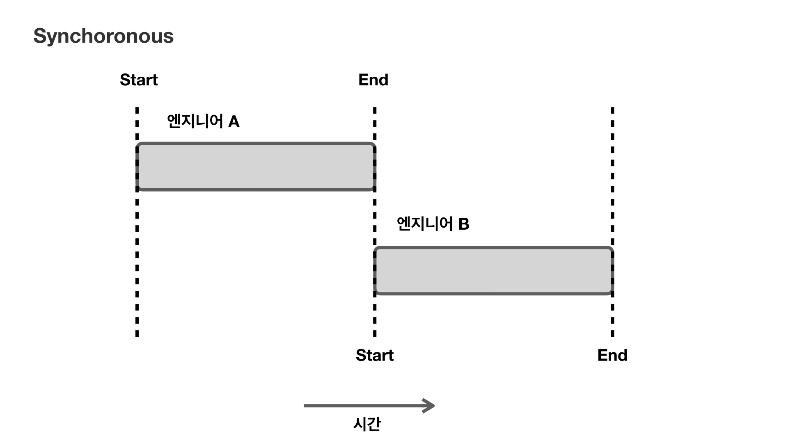

# Overview

이번 포스팅은 node.js를 공부하다 보면 등장하는 Blocking, Non-blocking에 대해서 알아본다. 또한 두 개념과 같이 언급되는 Synchoronous, Asynchoronous와 비교한다. Blocking, Non-blocking과  Synchoronous, Asynchoronous는 비슷하지만 명확히 다른 개념이다. 그렇기 때문에 항상 헷갈린다. 때문에 이번 기회에 확실히 알고 넘어간다.

본 포스팅에서 잘못된 정보가 있으면 댓글로 지적해주시면 감사하겠습니다.

# Blocking, Non-blocking

Blocking과 Non-blocking은 **제어권**이 어디에 있느냐에 관점이라고 할 수 있다. 하나의 처리되어야 하는 작업이 전체 작업 흐름을 Blocking(막느냐) 하느냐 Non-blocking(막지 않느냐) 하느냐에 대한 관점에서 접근해야 한다. **즉, 하나의 처리되어야 하는 작업에게 제어권이 있는지, 해당 작업을 시킨 주체에게 제어권이 있는지에 대한 것이다.**

위 이미지와 같이 회사에 개발 부서에서 프로젝트를 하나 맡았다고 하자. 개발 부서는 여러 가지 작업1, 2, 3 ...을 해야 한다. 엔지니어들이 작업을 나누어 처리하려고 한다. 프로젝트의 제어권은 팀장이 가지고 있으며, 팀장은 엔지니어 A에게 특정한 기능을 수행하는 모듈을 만드는 작업 2를 시킨다. 이 상황에서 Blocking과 Non-blocking이 어떻게 다른지 알아보자.

## Blocking

먼저 Blocking은 개발 부서 전체 작업의 제어권을 가지고 있는 팀장이 엔지니어 A에게 제어권을 넘겨주게 된다. 엔지니어 A는 제어권을 가지고 작업2를 수행하게 된다. 엔지니어 A가 작업을 수행하는 동안 팀장은 작업2가 끝나기만을 기다린다. 작업2가 끝나 결과로 특정 기능을 하는 모듈을 팀장에게 다 했다고 알린다. 이와 동시에 프로젝트의 제어권도 팀장에게 돌려준다. 즉, 제어권이 있어야 다음 일을 수행할 수 있는 것이다. 제어권이 없는 상태에서는 Blocking 되며 다른 일을 할 수 없는 상태가 된다.

## Non-blocking

Non-block은 위 이미지와 같이 제어권을 바로 팀장에게 돌려주는 것이다. 제어권을 바로 돌려 주기 때문에 팀장은 프로젝트의 다음 업무들을 분배하거나 직접 수행할 수 있다. 팀장이 프로젝트 전체 작업을 수행하는 동안 엔지니어 A는 작업2가 끝나면 만들어진 모듈을 결과로 알린다. 팀장은 "수고했어!" 한마디 달랑 남기고 모듈을 프로젝트에서 사용하거나 처리한다.

이렇게 Blocking과 Non-blocking을 알아보았다. 여기까지는 크게 어렵지 않다. 하지만 이와 자주 언급되는  Synchoronous, Asynchoronous를 같이 말하면 헷갈리기 시작한다.

# Synchoronous, Asynchoronous

동기(Synchoronous), 비동기(Asynchoronous)는 **작업을 수행하는 주체에 관점을 두는 것이다.** 두 개 이상의 주체가 작업의 시간을 똑같이 맞출 때 동기라고 하며, 두 주체가 서로 시간에 대해 관계가 없다면 이를 비동기라고 부른다. Blocking, Non-blocking과 어떤 차이가 있나? 바로 관점에 차이다. Blocking과 Non-blocking은 작업의 대상에 관점을 두는 것이다. 말로만 해서는 이게 뭔 소린가 싶다. 먼저 동기(Synchoronous)부터 알아보자.

## 동기(Synchoronous)

동기와 비동기는 작업을 수행하는 주체에 관점이라고 했다. 이 말을 다시 위 이미지와 같이 이해해 보면, 작업을 수행하는 주체 엔지니어 A, B가 있다. 엔지니어 A가 A의 작업을 수행하고 그다음에 엔지니어 B가 B의 작업을 수행하면서 **시간**을 맞추는 것이다. 엔지니어 A가 작업을 끝내게 될 시점에 엔지니어 B가 업무를 수행하게 맞추는 것을 동기라고 한다. 어떻게 보면 Blocking과 비슷해 보인다. 하지만 여기서 차이점은 Blocking은 작업에 관점에서 봐야 한다. "작업이 끝나기를 기다리다가 끝나면 다음 작업을 수행한다."가 Blocking이다. 차이가 명확하지 않다면 아래 이미지를 보자.

업무량이 다른 엔지니어 A, B가 업무를 시작하는 시간과 끝나는 시간을 맞추는 것도 동기이다. **즉, 동기는 업무를 하는 각 주체들이  업무를 시작하는 시간과 끝나는 시간을 맞추거나, 끝나는 시간과 시작하는 시간을 맞추는 것을 동기라고 한다.**

## Asynchoronous

비동기는 작업을 수행하는 주체의 시작과 끝나는 시간에 관계없이 각자 별도의 시작과 끝나는 시간을 가지고 있을 때를 말한다. 즉,  서로 다른 주체 간의 시작과 종료 시간이 영향을 주지 않을 때 비동기라고 할 수 있다. 비동기도 Non-blocking과 비슷해 보인다. 앞에서 언급했듯이 다른 점은 관점이다. Non-blocking은 모든 작업이 다른 작업이 끝날 때까지 기다리지 않아도 되는 것을 말하며 작업에 관점이 있는 것이다. 헷갈리 수 있으나 쉽게 이해하려면 **Blocking, Non-Blocking은 작업에 관점에서 기다리냐, 안 기다리냐를 말하는 것이고 동기, 비동기는 주체에 관점에서 시간을 맞추냐 안 맞추냐를 말하는 것이다. **

# Blocking, Non-blocking과 Sync, Async의 조합

Blocking, Non-blocking과 Synchoronous, Asynchoronous는 다른 개념이기 때문에 조합되어 사용될 수 있다. 각 조합하면 4가지 조합이 가능하다. 다시 프로젝트를 개발하는 개발 부서 예시로 돌아가서 각 조합에 대해 비교해보자.

## Synchoronous-Blocking

개발 부서의 팀장은 프로젝트를 동기적으로 진행하고자 한다. 동기로 진행하기 때문에 각 작업 주체인 팀장과 엔지니어 A는 시간을 맞춰야 한다. 더 풀어서 얘기하면, 팀장은 프로젝트를 설계할 때 기능 A가 만들어져야 기능 B를 만들 수 있도록 하였다. 그래서 기능 A를 엔지니어 A에게 만들라고 시켰다. 팀장은 기능 B를 엔지니어 B에게 시키기 위해서 엔지니어 A가 업무를 끝내는 시간과 엔지니어 B가 업무를 시작하는 시간을 맞춘다. 여기까지가 동기이다. 팀장(설계자, 프로젝트 책임자)의 입장에서 프로젝트를 수행하기 위해 기능 A를 맡은 엔지니어 A의 업무가 끝나는 시간, 기능 B를 맡게 될 엔지니어 B의 시작 시간을 맞추는 것이다. 

다음으로 엔지니어 A는 혹시나 팀장이 재촉하거나, 기능 B의 일부를 엔지니어 B에게 먼저 만들라고 시킬 수도 있으니(내 코드가 꼬이거나 두 번 일하게 될 수 있으니^^), 프로젝트 제어권을 달라고 한다. "팀장님 제가 끝나면 알려줄게요 모든 제어권을 넘기세요 ㅎ" 이렇게 제어권을 가지고 와 팀장을 Blocking 시킨다. 그럼 엔지니어 A가 기능 A를 다 만들기 전에 팀장은 다른 일을 못하고 반드시 기다리게 된다. 이 부분이 Blocking이다.

Synchoronous, Blocking은 비슷해 보였지만, 이렇게 조합한 예시를 들어 구분해보니 분명 관점의 차이가 있다.

## Synchoronous-Non-blocking

동기와 Non-blocking 조합은 위 이미지와 같이 팀장이 업무의 주체인 엔지니어 A, B의 작업 시간을 맞추고 있다. 엔지니어 A가 기능 A를 개발을 종료하면 그 시간에 엔지니어 B가 기능 B를 개발하도록 한다.(기능 A가 기능 B보다 우선순위가 높은 작업이거나 B에 사용될 수 있기 때문) 하지만 Non-blocking이기 때문에 팀장은 다른 여러 작업을 할 수도 있지만 프로젝트는 동기로 진행하도록 설계했기 때문에 이를 지켜야 한다. 대신 기능 A 개발이 끝나기를 손꼽아 기다리면서 주기적으로 결과 확인하는 작업(Polling)을 한다.(Non-blocking이기 때문에 Blocking 되지 않고 이런 Polling 작업 등을 할 수 있다.) 결국, 엔지니어 B는 일할 준비가 되어 있어도 팀장이 프로젝트를 동기로 설계했기 때문에 기다려야 하며 엔지니어 A로 부터 기능 A 개발의 결과를 받는 시간에 비로소 엔지니어 B가 작업을 수행할 수 있게 된다.

## Asynchoronous-Blocking

이번에는 비동기와 Blocking 조합에 대해 알아보자. 앞에서 비동기는 작업의 주체 간의 시간 관계가 없다는 것이라고 말했다. 예시에서 팀장은 프로젝트를 비동기 흐름으로 설계했다. 이 말은 기능 A가 반드시 기능 B전에 만들어져서 기능 B에서 사용되거나 하지 않아도 된다는 말이다. 즉, 작업의 우선순위가 없다는 말이다. 그렇기에 팀장은 비동기적인 설계를 할 수 있다. 그러나 기능 A를 개발하는 엔지니어 A는 제어권을 가져가 프로젝트를 Blocking 시킨다. 이로 인해 기능 A 개발이 종료되기 전까지 다른 기능들은 수행될 수 없다. 결국 비동기로 설계하였지만, Blocking에 의해 동기-Blocking과 같은 흐름을 갖게 된다.

## Asynchoronous-Non-blocking

마지막으로 비동기와 Non-blocking 조합을 알아보자. 비동기로 설계하였기 때문에 엔지니어 A, B의 시간을 맞추지 않는다. 즉, 서로 시간 관계가 없어도 된다.(기능 A는 기능 B 보다 우선 개발할 필요가 없다.) 그리고 기능 A를 개발하는 엔지니어 A는 프로젝트를 Non-blocking으로 제어권을 가져가지 않는다. 이로써 팀장은 엔지니어 B에게 기능 개발 B를 맡기고 또 다른 작업을 수행한다. 여러 작업들을 수행하고 있다가 기능 A 개발이 종료되어 결과를 엔지니어 A로부터 결과를 받으면 이에 맞는 처리를 수행하기도 한다.

# 정리

- Blocking은 작업에 관점을 두어 한 작업이 수행되는 동안 다른 작업을 할 수 없게 제어권을 가지고 있는 것이다. 작업이 끝나고 결과와 함께 제어권을 돌려준다.
- Non-blocking은 한 작업이 수행되는 동안 다른 작업을 할 수 있게 제어권을 바로 돌려주는 것이다. 다른 작업이 수행되고 있는 도중에 결과를 반환한다.
- 동기란 작업의 주체에 관점을 두어 작업을 하는 주체 간의 시간을 맞추는 것이다. 두 주체의 시작과 종료를 맞추거나 한 주체의 종료 시점에 다른 주체의 시작을 맞춘다. 이렇게 시간을 맞추는 것을 동기라고 한다.
- 비동기란 주체 간의 시간을 맞추지 않고 주체 간의 시간 관계가 없으며 서로 영향을 주지 않는 것이다.
- 동기, 비동기, Blocking, Non-blocking은 조합되어 설계될 수 있으며 4가지 조합이 될 수 있다.
- 동기-Blocking, 비동기-Blocking은 같은 흐름을 갖게 된다. 비동기라 할지라도 Blocking으로 제어권이 넘어가기 때문에 그동안 다른 작업을 수행할 수 없다. 결국, Blocking이 끝날 때 제어권을 돌려받아 다른 작업을 수행할 수 있다.
- 동기-Non-blocking은 각 작업의 주체가 시간이 맞춰져 있기 때문에 Non-blocking이라 할지라도 Polling으로 작업에 대한 결과를 주기적으로 확인할 뿐 결과가 반환되면 비로소 다른 작업을 수행한다.
- 비동기-Non-blocking은 각 작업의 주체가 서로 시간 관계가 없어 동시에 수행되어도 괜찮다. 또한 Non-blocking으로 제어권을 바로 돌려주어 각 작업의 주체들로 업무를 분산 시킬 수 있으며 각 작업이 끝나기를 기다리지 않는다. 각 작업의 주체는 작업을 하고 결과를 반환한다. 제어권을 갖는 전체 작업 흐름은 각 작업의 결과가 반환될 때 이를 처리한다.

  