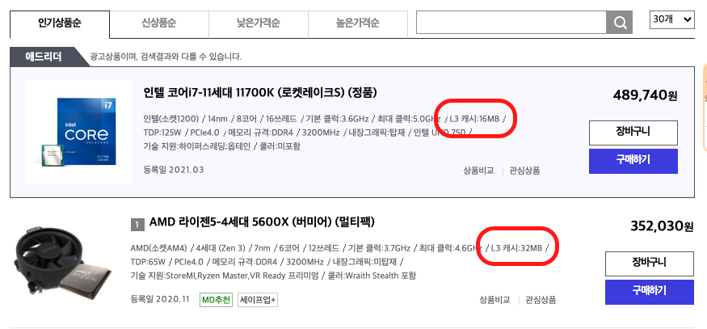

# Overview

이번 포스팅은 캐시가 무엇인지 알아보고 CPU 단의 캐시에 대해서 다룬다. 캐시는 CPU 단에서 말고도 다양한 곳에서 활용된다. 캐시 맵핑(직접 맵핑, 연관 맵핑, 집합 연관 캐시), 캐시에서 시스템 메모리로 쓰기는 하나의 포스트에 모두 담기에는 다소 길고 지루해질 수 있으므로 다른 포스팅에서 다룬다. 또한 메모리에 대한 포스팅인 만큼 SRAM, DRAM, SSD, HDD, 가상 메모리 등이 캐시 메모리를 설명하는 데 사용될 수 있다. 이런 관련된 개념은 다른 포스트가 쓰였다면 링크로 대신한다.

포스팅에 대해 잘못된 정보가 있으면 댓글로 지적해 주시면 감사하겠습니다.

# 캐시(Cache)

**캐시는 얻고자 하는 데이터를 필요한 순간마다 데이터가 저장되어 있는 저장소에서 가져오는 일에 대한 시간을 줄일 때 사용되는 임시 저장소이다.** 일상에서 비유하자면, 화장실을 생각해 볼 수 있겠다. 창고에는 화장실에서 필요한 물품들이 있다. 이 물품을 화장실에서 소비하고 떨어지면 창고에서 가져온다. 창고가 화장실과 가깝다면 크게 문제가 되지 않지만 멀리 떨어져 있다면 창고까지 갔다 오는 시간은 오래 걸릴 것이다. 때문에 화장실에 작은 수납공간을 만들고 처음 한 번만 창고에서 물품들을 가져다 놓는다. 그러면 창고까지 매번 풀품을 가지러 가지 않고 화장실 수납공간에서 바로 꺼내 쓰면 된다. 이처럼 다음에 다시 사용될 것 같은 물건(데이터)을 가까운 곳에 배치하여 시간 효율성을 높일 때 배치되는 공간이 바로 캐시다.

# CPU 단에서 캐시(Cache)

컴퓨터 시스템에서 Cache를 사용한다. 프로그램이 실행되어 운영체제가 시스템 메모리를 할당하게 되면 하나의 프로세스가 만들어지고 CPU는 이를 수행한다. CPU는 명령을 수행할 때 필요한 데이터를 프로세스에 할당된 시스템 메모리에서 가져와 명령에 맞는 연산을 수행한다. 이때 아무리 빠른 메모리 시스템을 만든다고 하더라도 CPU보다 빠른 엑세스가 가능한 메모리를 만드는 일은 힘들다. 그래서 항상 메모리 성능은 전반적인 시스템 성능을 저하시키는 요인이 된다. 이를 해결하기 위해 **데이터를 CPU와 가까운 곳에(빠르게 엑세스 할 수 있는 곳) 배치해두는 데이터 캐싱 방법을 사용하게 되었으며 데이터가 배치되는 임시 기억장치가 캐시다.**

데이터 캐시는 CPU와 시스템 메모리 사이에 있는 고속 메모리 블록이다. 캐시 메모리는 시스템 메모리보다 훨씬 빠르다. 캐시의 기본적인 동작은 최소에 CPU는 시스템 메모리에서 데이터 블록을 읽고 이를 데이터 캐시에 저장한다. 다음에 CPU가 메모리에서 데이터를 읽어야 할 때 먼저 필요한 항목이 캐시에 있는지 확인하고, 캐시에 있으면 CPU가 시스템 메모리가 아닌 캐시에서 데이터를 가져온다. 이런 상황을 **'캐시 적중(cache hit)'**이라고 한다. 캐시에 데이터가 없으면 **'캐시 미스(cache miss)'**가 발생하고 시스템 메모리에 엑세스하여 데이터를 가져오고 캐시에 저장한다.

이렇게 필요한 데이터를 매번 시스템 메모리에서 가져오지 않기 위해 캐시를 사용하는데 CPU가 필요한 데이터가 캐시에 있을 가능성이 얼마나 될까? 대부분의 상황에서는 필요한 데이터가 캐시에 있다. 이는 **참조 국부성(locality of reference)**이라는 원리(한국말이 더 어렵다...ㅎ)에 의한 것인데, 이 원리는 컴퓨터 작업이 함께 묶이는 경향이 있음을 나타낸다. 참조 국부성에는 세 가지 측면이 있다.

- 시간 지역성: 현재 액세스 된 동일한 데이터는 가까운 미래에 다시 액세스 될 것이다.
- 공간 지역성: 짧은 시간 동안의 데이터 액세스는 동일한 메모리 영역에 묶여 있는 경향이 있다.
- 메모리 위치는 순차적으로 읽히거나 쓰이는 경향이 있다.

## 캐시의 계층구조

캐시가 시스템 메모리보다 빠르다고 했다. 이는 캐시는 SRAM이며(SRAM, DRAM은 다른 포스팅에서 다루겠다.) 물리적으로 CPU에 가까이 위치해있다. 또한 캐시는 크기가 작기 때문에 빠르다. 시스템 메모리는 보통 4GB, 8GB 등 GB 단위지만 캐시는 몇 MB 이상을 저장하는 경우가 거의 없다. 결국 메모리에서의 주소 비트 수가 더 적기 때문에 CPU가 필요로 하는 데이터 검색이 빠르다. 즉, 캐시에 데이터가 있는지 여부를 쉽게 판별할 수 있다. 시스템 메모리 크기처럼 크게 만들 수도 있겠지만 그러면 당연히 크기가 작은 것에 비해 속도가 느려진다.

그렇다면 캐시를 크게 만들려면 어떻게 하면 될까? 이때 사용되는 방법이 캐시를 계층구조로 나누는 것이다. 최근 마이크로프로세서는 최소한 두세 개의 계층을 가지고 있다. 레벨 1 ~ 레벨 3에 나눠 L1, L2, L3 캐시로 나뉘게 되고 레벨 1부터 CPU에 가깝다. L1 캐시가 가장 작고 빠르며 L3 캐시가 무겁고 크며 느리다. 위에서 언급했듯이 용량이 크면 그만큼 필요한 데이터가 캐시에 있는지 찾기 어렵기 때문에 속도가 느리다고 하였다.

최근 CPU는 기본적으로 멀티 코어가 탑재되어 있다. 이에 L3 캐시를 지원하는 CPU가 많은데, L3 캐시는 모든 코어가 공유할 수 있는 캐시 메모리이기 때문이다. 그리고 각 코어마다 L1 캐시 L2 캐시를 가지고 있다. 즉, 각 코어마다 L1, L2 캐시가 있고 L3는 공유한다.

CPU는 필요한 데이터에 액세스할 때 가장 가까운 레벨 1에 있는 L1 캐시를 먼저 탐색한다. L1 캐시에 없다면 L2 캐시를 탐색하고 없다면 L3 캐시를 탐색한다. 그래도 없다면 시스템 메모리에서 데이터를 인출하고 다시 캐시에 저장한다. 물론 시스템 메모리 이외에도 SSD, HDD 저장소에도 기록될 수 있다. 하지만 가장 느리고 메모리 주소로 직접 액세스할 수 없다.

캐시에 기본적인 동작을 이해했다. 그렇다면 의문이 생긴다. 시스템 메모리의 데이터를 캐시의 어느 위치에 저장할 것인가? 이를 **'캐시 매핑(cache mapping)'이라고 하며, 캐시 매핑을 어떻게 하느냐에 따라 CPU가 요청받은 주소가 캐시에 있는지 파악하는 방법이 달라진다.** 즉, 캐시 매핑은 시스템 메모리에서 가져온 데이터 블록을 캐시의 어느 위치에 연결하는지 대한 방법론이다. 최근 컴퓨터에서는 '집합 연관 캐시(set-associative cache)'라는 캐시 체계를 사용하며 이는 직접 매핑 방식과 연관 매핑 방식의 조합이다. 캐시 매핑에 대한 내용은 다른 포스트에서 다루도록 한다.

# 정리

- 캐시는 얻고자 하는 데이터를 필요한 순간마다 데이터가 저장되어 있는 저장소에서 가져오는 일에 대한 시간을 줄일 때 사용되는 임시 저장소이다.
- CPU 단에서 캐시 메모리는 전반적인 시스템 성능을 개선하기 위한 방법으로 높은 성능의 메모리를 개발하는 대신 CPU와 가까운 위치에 용량을 작게하여 빠른 액세스 가능한 메모리를 두는 것이다.
- 캐시는 보통 L1, L2, L3로 나뉘며 L1부터 CPU에 가깝게 배치된다. L1, L2는 각 코어마다 가지고 있는 캐시, L3는 모든 코어가 공유하는 캐시이다.

- CPU가 캐시에 필요한 데이터가 있는지 여부를 파악해야 하는데, 캐시 매핑 방법론에 의해 달라진다. 캐시 매핑은 직접 매핑과 연관 매핑이 있으며 두가지를 조합해 오늘날 캐시 체계로 사용된다.