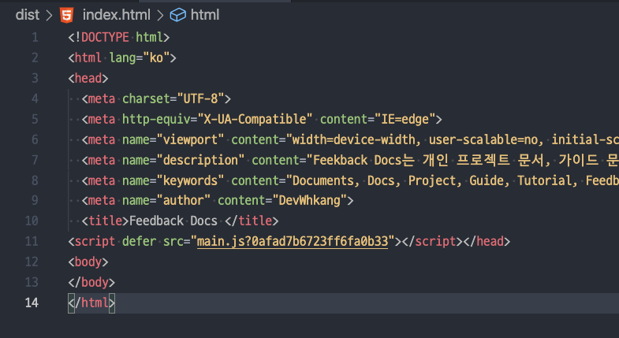

# Overview

Node.js 환경에서 개인 프로젝트를 위해 모듈 번들러인 Webpack을 초기 세팅하고 있었다. 필요한 로더와 플러그인을 설치하고 빌드가 예상한 대로 잘 동작하는지 확인하고 있었다. 자주 사용하는 플러그인 `html-webpack-plugin`그런데 무심코 지나칠 뻔한 script 태그의 변형이 눈에 띄었다. `html-webpack-plugin` 플러그인은 정적 파일 배포 시 브라우저 최적화를 위해 사용하려고 하는 것인데, output 폴더(/dist)에 플러그인이 적용된 index.html 파일을 열어보니 `<script>` 태그에 `<script defer>` 라는 속성이 추가되었다. "음... 이런 옵션은 준 적이 없는데..." 하며 `html-webpack-plugin` 플러그인 문서를 보았다. 해당 부분을 잘 찾지 못해 defer 속성이 무슨 의미인지 구글링 했고 이를 포스팅한다. 자주 사용되는 script 속성인데 지금까지 몰랐다니... 이번 기회에 정리하고 필요하다면 적절히 사용해야겠다.





# 일반적인 웹 브라우저에서 HTML과 script 태그


```html
<body>
	<!-- 먼저 위치한 태그 -->

	<script src='./대용량.js'></script>

	<!-- 나중에 위치한 태그 -->
</body>
```


대부분 그러하겠지만, 운용되는 웹 페이지에서는 `script` 태그에 `src` 속성에 javascript 파일 경로를 위치시킨다. 그리고 대부분 용량이 HTML보다 크다. 파서가 HTML을 파싱 하다가 `script `태그를 만나면 스트립트 로딩을 시작하는데, 이때 파서는 HTML 파싱을 멈추고 스크립트가 실행이 끝날 때까지 기다린다. 그런데 스크립트 파일 용량이 크지 않다면 해당 페이지를 요청한 사용자에게 큰 영향을 주지 않겠지만 스크립트 용량이 크다면 로딩하고 실행하는데 시간이 오래 걸릴 것이다. 이는 HTML 파싱을 막아 사용자에게 페이지를 모두 보여주지 못하고 스크립트가 온전히 실행되고 나서야 모두 보여주게 되므로 사용자 경험이 다소 떨어질 수 있다. 또한 스크립트가 `script` 태그 아래 태그에는 접근하지 못하게 되어 스크립트가 실행될 수 없는 상황이 올 수도 있다. 그래서 대부분은 스크립트를 body 태그의 가장 아래에 위치시켜 페이지를 먼저 보여주려고 한다. 


```html
<body>
	<!-- 먼저 위치한 태그가 많다 -->
	<script src='./대용량.js'></script>
</body>
```


그렇다면 반대로 HTML 문서의 용량이 엄청 크다면 페이지를 사용자에게 보여주기까지 오랜 시간이 걸릴 것이다. 만약 가장 먼저 위치한 태그를 핸들링 하는 스크립트 코드가 있다면 페이지가 모두 그려지기 전까지 스크립트는 실행되지 못할 것이다. HTML, 스크립트 용량과 스크립트가 필요한 시점이 다르기 때문에 부작용과 이슈가 생겨날 수 있다.

# defer

defer 속성은 HTML과 스크립트 간의 이슈를 해결해 줄 수 있다. defer 속성이 부여되면 브라우저는 해당 `script` 태그의 기능을 백그라운드로 이동시킨다. 그리고 백그라운드에서 로딩을 한다. 로딩이 끝나면 HTML 파싱이 끝나기를 기다리다가 파싱이 모두 끝나고 DOM 트리가 준비되면 해당 스크립트를 실행시킨다.(DOMContentLoaded 이벤트 발생 전에 실행된다고 한다.) 이렇게 동작한다면 대용량 스크립트일 경우 HTML 파싱과 스크립트 로딩이 동시에 수행되는 효과를 볼 수 있기 때문에 높은 사용자 경험을 제공할 수 있다. 즉, DOM 트리가 준비되는 시점과 스크립트의 로딩이 끝나는 시점을 맞춰 동기적으로 동작하게 하지만, 백그라운드에서의 작업(로딩)은 non-blocking으로 HTML 파싱이 수행될 수 있게 하는 것이다.

> 동기, 비동기 / bocking, non-blocking은 Node.js 관련 포스팅에서 다룬적이 있다. 아래 포스트를 참고 하면 된다.
>
> - [Blocking, Non-blocking과 Sync, Async에 대하여](https://devwhkang.gatsbyjs.io/posts/async-sync-blocking-non-blocking/)


```html
<!-- HTML 태그 -->
<script defer src='용량이 큰.js'></script>
<script defer src='용량이 큰.js'></script>
<!-- HTML 태그 -->
```


또한 순서를 유지하여 실행되는데, HTML 문서에 작성한 순서대로 실행된다. 예를 들어, 용량이 작은 스크립트와 용량이 큰 스크립트가 있고 용량이 큰 스크립트를 먼저 상위 라인에 위치시키고 그다음으로 작은 용량 스크립트를 위치시킨다고 한다면, 백그라운드에서 두 스크립트의 로딩이 시작되고 당연히 용량이 작은 스크립트가 먼저 로딩될 것이다. HTML DOM 트리는 준비가 되어 있는 상태에서 용량이 작은 스크립트는 먼저 실행되지 않는다. HTML 문서에서 용량이 큰 스크립트가 먼저 상위 라인에 위치하였기 때문에 이 순서를 지켜 용량이 큰 스크립트 먼저 실행되고 이후 용량이 작은 스크립트가 실행된다.

> - 백그라운드에서는 로딩은 여러 자바스크립트 파일이 병렬로 로딩한다.
>
> - `script` 태그에 source 속성(src)가 없다면 defer 속성이 무시된다.

# async

defer 속성 이외에도 비슷한 동작을 하는 속성이 있다. async 속성은 속성 이름답게 비동기적 처리를 하는 속성이다. defer와 비슷하게 백그라운드에서 실행되지만 HTML 문서와는 완전히 독립적으로 동작하게 된다. 큰 차이는 defer 속성은 DOMContentLoaded 이전에 실행되지만, async는 DOMContentLoaded와도 관련이 없다. 따라서 async 속성이 있는 `script` 태그는 HTML 페이지 구성이 모두 끝난 후에 실행될 수도 있는 것이고, 페이지 구성이 덜 된 상태에서도 실행될 수 있다는 것이다. 즉, 작 업을 하는 주체 파서, 백그라운드(스레드)는 특정 시간을 맞추지 않는다는 것이고 비동기적으로 실행된다는 것이다. 백그라운드에서 스크립트가 로딩될 때 파서는 계속 파싱하고 DOM 트리를 준비하므로 non-blocking이라 할 수 있다.

> - 로딩은 non-blocking 하지만, 스크립트 실행은 HTML 파싱을 멈춘다고(blocking) 한다.

또한 defer 속성과는 다르게 순서를 보장하지 않는다. 먼저 로딩된 스크립트 파일이 먼저 실행된다. (a.k.a 'load-first order') 자바스크립트 파일이 여러 개라면 어떤 스크립트가 먼저 실행될지 모르고 언제 실행될지 모르기 때문에 주의하여야 할 것이다.

# defer, async 사용시 주의해야할 점

- async 속성은 페이지가 모두 그려지기 전에 스크립트가 실행될 수도 있지만, 스크립트 용량이 클 경우 페이지가 모두 그려진 후에 실행될 수도 있기 때문에 사용자에게 해당 스크립트가 동작해야 하는 특정한 이벤트와 같은(예를 들어 버튼) 부분들은 비활성화하거나 어떤 조치를 취해야 한다. 마찬가지로 defer 속성은 반드시 페이지가 모두 그려진 시점에 실행되기 때문에 비활성, 로딩창 등의 조치를 취해야 한다.
- 스크립트의 실행 순서가 중요한 경우 async 속성을 사용하면 안 된다. 언제 스크립트가 실행될지 예측하기 어렵기 때문에 스크립트 순서를 보장할 수 없다. 이럴 때는 defer 속성을 사용하는 게 좋겠다.
- async 속성을 사용할 때는 페이지에서 독립적인 부분에 스크립트가 동작할 때 사용하는 것이 좋겠다. 방문자 수, 광고 등 페이지의 주요 부분이 그려지는데 영향을 주지 않고 해당 스크립트만의 영역에서 사용될 때 유용하겠다.

따라서 두 속성을 적절히 사용하면 높은 사용자 경험을 제공할 수 있겠다.