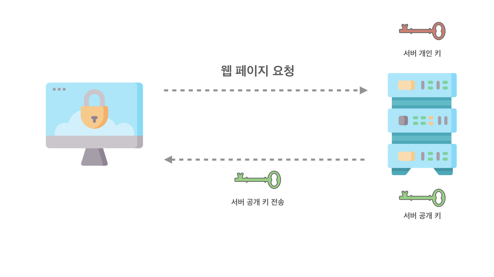
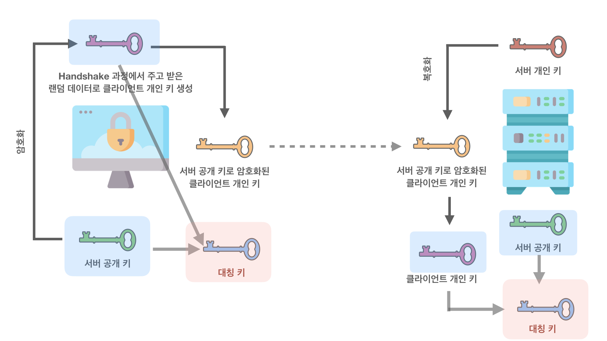
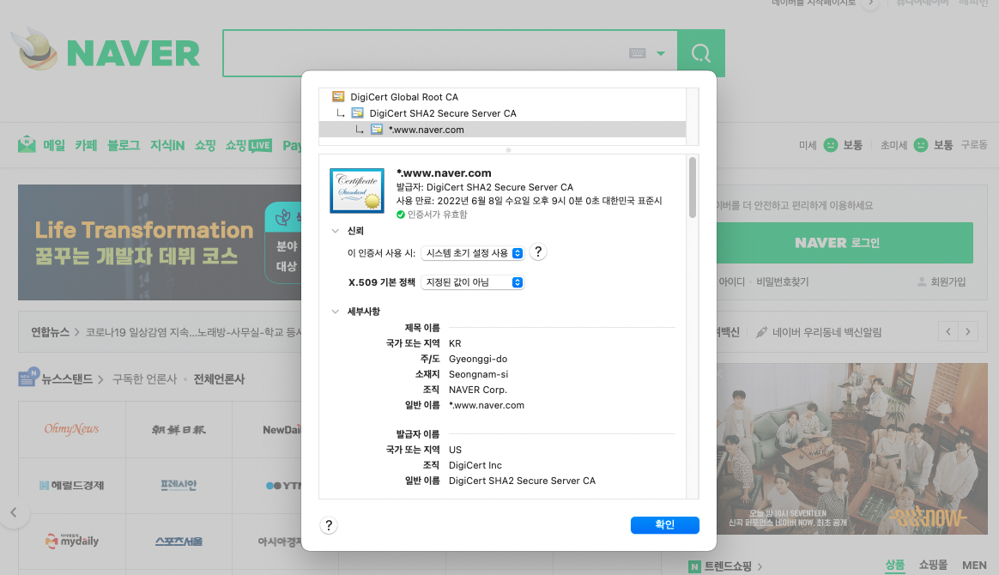

# Overview

이번 포스팅은 HTTPS의 동작 방식에 대하여 정리한다. 동작 방식을 정리할 때 대칭 키, 비대칭 키(공개 키), HTTP, TCP, TLS, SSL에 대한 내용은 구체적으로 다루지 않는다. 이 포스트를 읽으시는 분들은 아래 Prerequisites를 알고 있다고 가정해서 작성한다.

## Prerequisites

- Symmetric key
- Public-Private key pair - Asymmetric key
- HTTP, TCP, TLS, SSL

> 본 포스팅에서 잘 못된 정보가 있다면 댓글로 지적해 주시면 적극 반영하겠습니다.

# SSL=TLS Protocal Layers

먼저, HTTPS와 SSL 그리고 TLS를 먼저 가볍게 정리한다. HTTPS는 Hypertext Transfer Protocol over Secure Socket Layer의 약자이다. HTML 문서를 통신하기 위한 규약인데 SSL(Secure Socket Layer) 위에서 이루어지는 것이다. 즉, HTTP(Hypertext Transfer Protocol)가 어떤 보안 체계(SSL)를 사용하여 통신하게 되는 프로토콜 방식을 HTTPS라고 한다.

일반적인 네트워크 통신에서 인터넷 프로토콜은 기밀성을 유지하지 못해 보안성이 낮다. 이를 보완하기 위해 통신 규약 프로토콜이 생겼는데, 이게 SSL이다. HTTP 프로토콜이 SSL이라는 보안 체계를 갖춘 프로토콜을 사용하게 되면 HTTPS가 되는 것이고 FTP는 SFTP가 되는 것이다. 

SSL은 넷스케이프가 만들었다. SSL이 대중화되면서 국제 표준화 기구(IETF)로 넘어갔다. 넘어가서 SSL은 TLS(Transport Layer Security)라는 이름으로 변경되었다. 그래서 HTTPS 관련 에러가 발생했을 때 TLS라는 용어를 자주 볼 수 있다. 하지만, 전통적인 이유?로 인해 SSL이 더 많이 쓰이는 용어라고 생각하면 좋겠다.

그렇다면 SSL에서 어떻게 기밀성을 유지하여 보안을 강화하는지 알아보도록 하자.

# 키를 공유하여 정보를 암호화

로그인이나, 결제 등의 중요한 정보를 통신해야 할 때 클라이언트와 서버는 HTTPS 프로토콜을 통해 기밀성을 유지하고 보안을 강화하여 통신한다. 이때 클라이언트와 서버는 동일한 키를 공유하고 있어 클라이언트가 정보(메시지)를 해당 키로 암호화하여 서버로 요청을 보낸다. 서버는 암호화된 데이터를 공유하고 있는 같은 키로 복호화 하여 정보(메시지)를 확인한다. 그런데 이런 대칭 키 공유 방식은 동일한 키를 공유하는 데는 단점이 있다. 최초 한 번은 키를 주고받아야 하기 때문에 중간에 해커가 이를 가로챌 수 있다. 이런 이유로 클라이언트와 서버는 대칭 키를 공유하기 위해 비대칭 키(공개 키) 방식으로 공유하고자 하는 대칭 키를 주고받는다. 이런 SSL 보안 체계 방식으로 HTTP는 HTTPS로써 동작한다.

## 대칭 키를 공유하기 위한 비대칭 키(공개 키) 방식

앞으로 비대칭 키를 공개 키라고 하겠다. 서버는 자신의 개인 키(private key)와 공개 키(public key)를 가지고 있다. 사용자가 브라우저를 통해 서버에 웹 페이지를 요청하면 서버는 공개 키를 브라우저로 응답한다. 그러면 브라우저는 서버의 공개 키를 갖게 된다.

이제 클라이언트는 공개키를 가지고 있다. 클라이언트는 Handshake 단계(난수를 주고받으며, 암호화에 사용될 알고리즘을 합의한다.)에서 주고받은 랜덤 데이터(난수)를 가지고 클라이언트 개인 키를 만든다. 그리고 전달받은 서버의 공개키로 암호화를 진행한다. 서버의 공개 키로 암호화된 클라이언트 개인 키를 서버에게 전송한다.

이제 클라이언트, 서버 모두 서버의 공개키와 클라이언트 개인 키를 가지게 된다. 이 두 가지 키를 가지고 클라이언트와 서버의 대칭 키를 만든다. 결과적으로 클라이언트와 서버는 대칭 키를 공유하게 된다. 이렇게 공유된 대칭키를 가지고 웹 사이트 요청과 응답과 같은 메시지를 암호화하여 주고받게 된다. 이는 대칭 키의 단점(최초 한 번은 노출될 수 있는 상태로 키를 전송해야 함)을 극복하기 위해 공개 키 방식을 이용하여 제3자가 가로챌 수 없는 대칭 키를 공유하게 된 것이다.

# 3rd party certificate

HTTPS 프로토콜은 공개 키와 대칭 키의 조합된 방식으로 클라이언트, 서버가 통신하게 된다. 클라이언트가 어떤 서버와 일련의 과정을 통해 대칭 키를 공유했다. 그런데, 그 서버는 신뢰할 수 있는 서버인가? 클라이언트의 웹 페이지 요청에 대해 해커가 의도적으로 실제 서버와 비슷하게 만들어 클라이언트에게 제공한다면? 

예를 들어, 클라이언트는 네이버 서버로 메인 페이지를 요청했다. 그런데 해커가 중간에 클라이언트 요청을 가로채서 네이버 메인 페이지와 똑같은 페이지인 메이버 페이지를 응답하게 되는 상황이라면, 클라이언트는 해커의 서버와 일련의 과정을 통해 대칭 키를 공유하게 된다. 클라이언트는 그것도 모른 채 네이버가 맞겠지... 하며 메이버에서 로그인을 하고 쇼핑을 하다면... 당연히 해커에게 개인 정보를 알려주게 되는 것이다. 즉, 클라이언트가 어떤 서버에게 데이터 요청을 했을 때 그 어떤 서버는 신뢰할 수 있는 서버이어야 한다.

## CA(Certificate authority)

서버를 신뢰할 수 있도록 제3의 기관이 존재한다. CA라고 불리는 혹은 Root Certificate라는 기업은 엄격하게 공인된 기업으로 서버가 신뢰할 수 있는 서버라는 것을 증명해 주는 기관이다. 서버는 심사를 거쳐 CA에게 인증서를 받게 된다. 클라이언트는 CA를 통해 내가 데이터를 요청하고자 하는 서버가 신뢰할 수 있는 인증된 서버라는 것을 알 수 있다. CA는 여러 기업이 있으며 이 기업 목록은 브라우저에 등록되어 있다. 클라이언트가 서버에게 데이터 요청을 할 때 서버는 **서버의 공개 키와 함께 CA 기관에서 인증받은 인증서를 보낸다.** 클라이언트는 공개 키와 인증서를 받은 다음 인증서를 발급해 준 CA 기관을 브라우저 목록에서 찾아 인증서가 유효한지 확인한다. 이로써 클라이언트는 서버를 신뢰할 수 있게 되고 브라우저 주소창에는 🔓자물쇠 모양이 나타나게 된다.

> **CA의 인증서 암호화**
>
> CA는 서버에게 발급해 줄 인증서를 CA의 개인 키로 암호화하여 발급한다. 브라우저는 CA 기관 목록과 각 기관의 공개 키를 가지고 있다. 그래서 서버가 클라이언트에게 인증서를 보내면 클라이언트는 인증서를 CA의 공개 키로 복호화 하여 인증서를 확인한다.

# 정리

보다 더 구체적인 과정이 있지만, 전체적인 HTTPS의 동작 방식에 대해 알아보았다. 결국, 기밀성 유지로 보안 강화 그리고 서버와 클라이언트 간의 신뢰를 위해 HTTP 프로토콜은 SSL의 보안 체계를 사용하여 HTTPS로 동작하게 된다. 

- 기밀성 유지를 위해 대칭 키를 사용하여 메시지를 암호화한다. 
- 대칭 키는 공개 키 방식을 통해 서버와 클라이언트가 안전하게 공유할 수 있다. 
- 서버를 신뢰하기 위해 제3의 공인된 인증 기관의 도움을 받아 서버를 신뢰할 수 있다.

