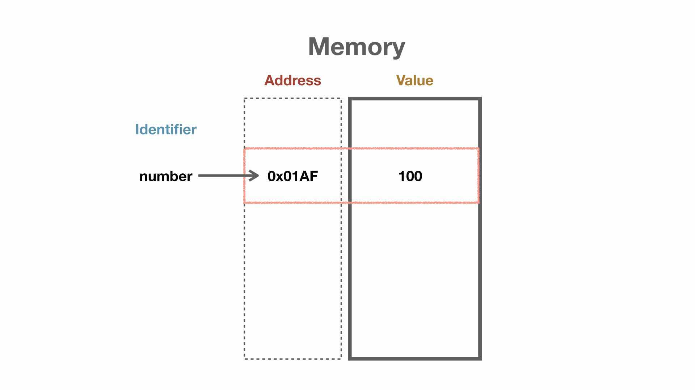
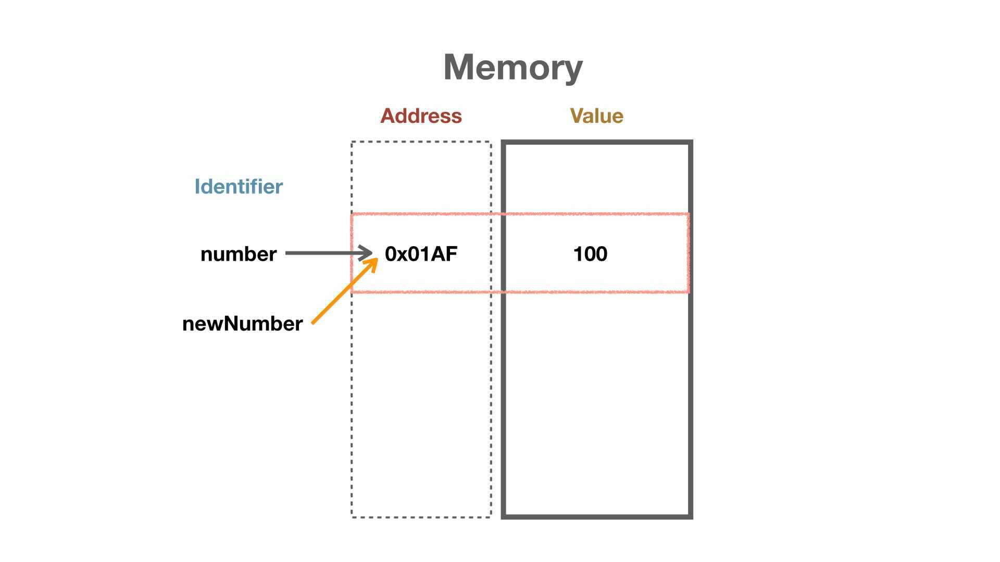
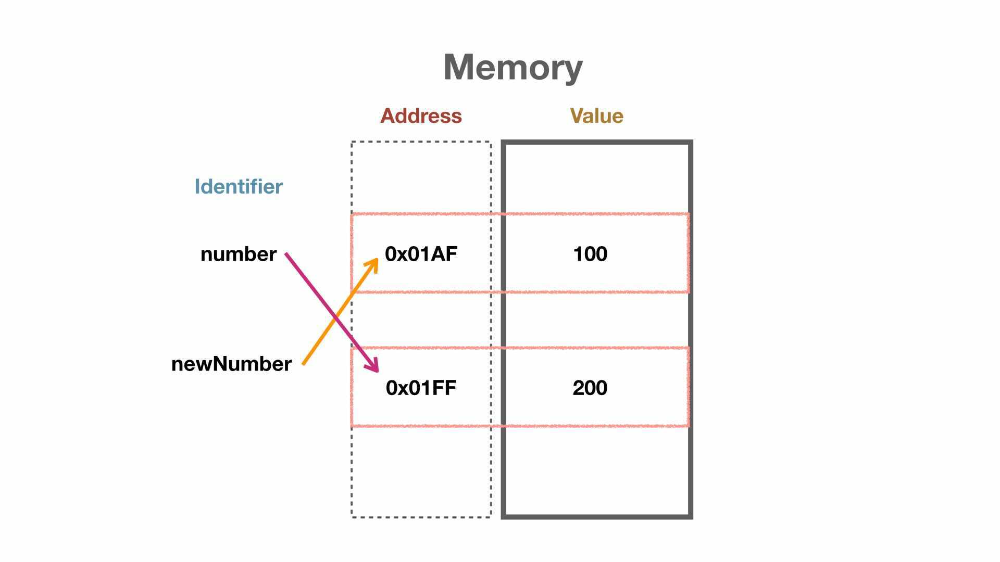
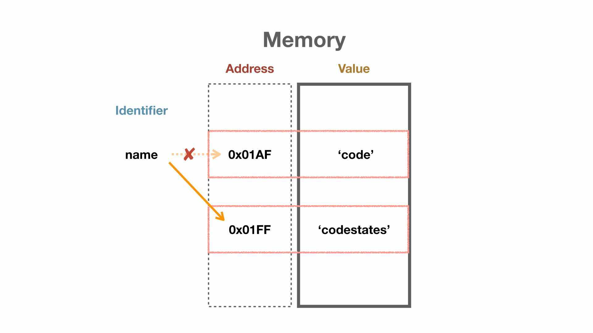
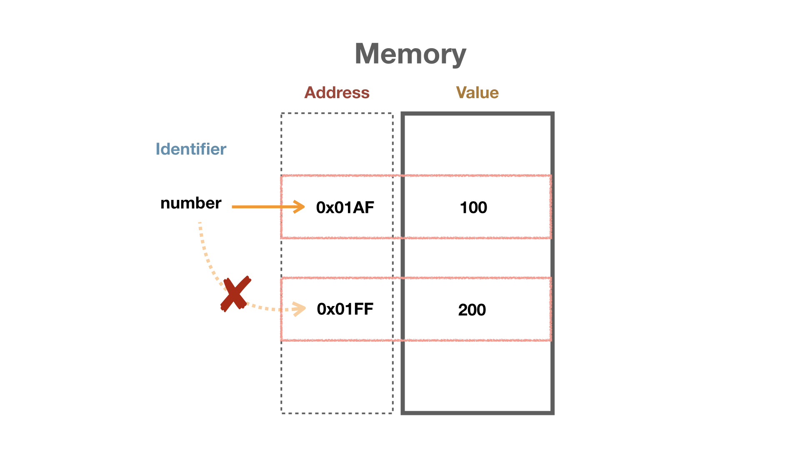
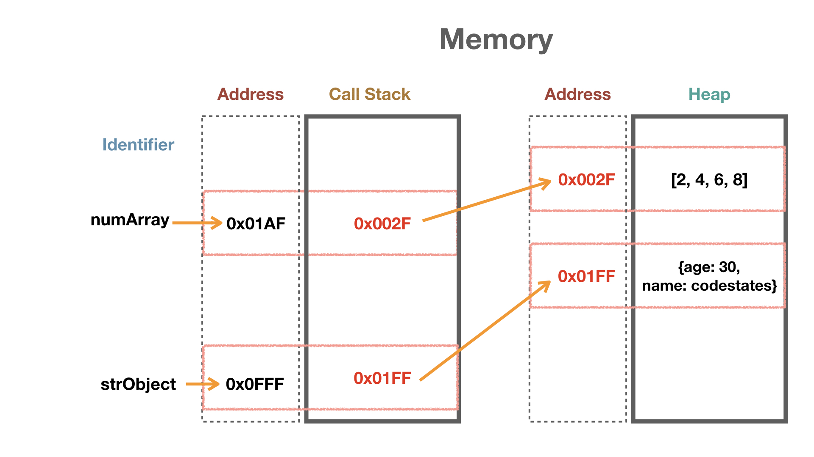

# Overview

지금껏 let, const 키워드를 이용해 변수를 선언해 왔다. 단순히 "이렇게 하면 이렇게 된다."와 같이 키워드의 특성을 외우는 정도로 이해하고 사용했다. 그런데, 변수를 선언할 때 실제로 메모리에서는 어떤 일이 발생할까? 실제 물리 메모리로의 매핑은 아니지만 Javascript가 Google Chrome이나 Node.js와 같은 런타임 환경에서 할당받는 메모리에 어떻게 매핑되는지 알아보겠다.

부족한 부분은 댓글로 지적해 주시면 감사하겠습니다.

# V8


다른 포스팅에서 V8 엔진에 대해 다루겠지만, 먼저 V8 엔진에 대해서 간단하게 알고 가자. 대표적인 자바스크립트 런타임 크롬 브라우저, Node.js에는 V8 엔진이라는 일종의 번역기가 내장되어 있다. 여기서 번역기는 각 나라가 정상회단을 할 때 통역사 역할과 비슷하다. **0과 1밖에 모르는 컴퓨터에게 자바스크립트라는 언어로 말해도 V8 엔진이라는 통역사가 0과 1로 변환하여 컴퓨터에게 알려준다.**(실제로 복잡한 과정을 거친다.) 이로써 컴퓨터와 우리는 소통할 수 있게 된다. 여기서 주목할 점은 통역사가 각 나라의 대통령이 말하는 것을 **실시간**으로 번역한다는 것이다. 대통령이 한마디 할 때마다 통역사는 자신의 뇌 어딘가에 대통령이 한 말을 임시로 기억하고 번역하여 상대방 대통령에게 알려준다. 이때 통역사의 뇌가 메모리와 유사하다. 메모리는 우리가 let, const를 이용해 변수를 선언할 때의 기억 공간이다.


V8 엔진 내부 기억 공간은 두 가지로 나눠진다. 위 이미지에서 보이듯이 Memory Heap이라는 공간, Call Stack이라는 공간으로 나눠져서 데이터를 저장하고 관리한다. 변수 할당에서 Memory Heap과 Call Stack의 차이를 먼저 알아보자. Call Stack은 정적인 공간(공간 크기가 정해져 있는)이다. 데이터 원시 타입(Primitive Type), 함수 호출(Function Call)이 이곳에 저장된다. Heap은 동적인 공간(상황에 따라 커지고 작아지는)이다. 데이터 참조 타입(Reference Type)인 배열, 객체가 저장된다. 두 공간의 특성을 알았으니 이제 메모리 선언과 할당을 해보자.

# let, const Keyword of Primitive Type

## let Keyword

```js
let number = 100;
```

위처럼 변수명 number에 100이라는 값(value)을 초기화 시킨다면 메모리에서는 어떤 일이 일어날까?





위 이미지와 같은 형태로 메모리에 할당된다. 이 과정을 여러 가지로 표현할 수 있는데, 여기서 **중요한 점은 특정 주소에 공간을 마련한다는 것이다. 그리고 그 공간의 이름은 number라는 식별자로써 사용하게 된다.**

```js
let newNumber = number;
```

이번에는 새로운 변수에 number를 할당한다. 이때 아래 이미지와 같이 같은 주소를 **참조**(reference) 하게 된다.





```js
number = number * 2;
```

위 예시 코드에 경우는 어떻게 될까? 당연히 number는 200이라는 값을 가지게 된다. 그런데 newNumber도 같은 200이라는 값을 가지게 될까? 예상과 달리 **number는 새로운 주소와 공간을 할당받고 200이라는 값을 저장한다.** 아래 이미지와 같이 0x01FF라는 새로운 주소와 공간에 200을 저장한다.





```js
let name = 'code';
name + 'states';
```

문자열의 경우도 마찬가지다. 기존 name의 주소가 아닌 새로운 주소와 공간을 할당받고 'codestates'를 저장한다.





## const Keyword

그렇다면 const 키워드로 변수를 선언하면 어떻게 될까? const 키워드의 특성에는 재할당이 불가능하다는 점이다.(물론, TDZ와 관련한 특성도 있다) 아래 코드를 보자.

```js
const number = 1;
number = 2;
// Assignment to constant variable.

const str;
// Missing initializer in const declaration
```

**const 키워드로 선언한 변수는 재할당이 불가능하며, 선언, 초기화, 할당이 동시에 이루어져야 한다.** **const 키워드는 let 키워드와는 달리 메모리 이동을 할 수 없다는 것이다.** 만약 let 키워드로 변수를 선언하고 값을 할당한 후에 다시 해당 변수에 다른 값을 넣으면 메모리 이동(새로운 메모리 공간 할당)이 이루어지면서 재할당한다. 반면 아래 이미지처럼 const 키워드는 이러한 메모리 이동(새로운 메모리 공간 할당)을 할 수 없다.





# Reference Type

이렇게 우리가 선언 또는 할당하는 변수는 메모리에서 주소와 함께 동작한다. 이제 주소에 어느 정도 익숙해졌다면 참조 타입(Reference Type)의 메모리 할당도 알아보도록 하자.

```js
const numArray = [2, 4, 6, 8];

```

앞에서 "Heap은 동적인 공간(상황에 따라 커지고 작아지는)이다. 데이터 참조 타입(Reference Type)인 배열, 객체가 저장된다."라고 언급했었다. 우리는 동적인 상황에서 데이터를 저장하고 싶을 때가 많다.(입력을 받아 데이터를 저장한다던지 하는) 이를 위해 Heap이라는 동적인 메모리 공간을 활용하게 되고 Heap에 저장된 배열, 객체의 주소값만 Call Stack에서 저장하고 있다. 아래 이미지를 보자.





위 이미지에서와 같이 각 변수의 메모리 공간에는 주소가 들어가 있다. 그리고 그 주소를 따라가면 Heap이라는 메모리 영역에 배열과 객체가 있다. 이렇게 Heap의 메모리 주소를 이용하여 변수에 할당한다. 배열에 데이터를 동적으로 추가한다면(물론, 자바스크립트 배열 특성상 크기를 미리 정하지 않아도 된다.)

```js
numArray.push(10);
```

이렇게 추가할 것이다. 동작은 numArray라는 변수 주소(0x01AF)로 찾아가 저장된 값을 본다. 그 값은 주소(0x002F)이고 해당 주소로 찾아간다. 해당 주소는 Heap이며 주소에 해당하는 배열 `[2, 4, 6, 8]` 에 `10` 을 추가한다. 객체도 마찬가지로 동작한다.

## 예측 가능한 코드

변수명을 a, b, c로 지은 코드가 있다면 어떤 생각이 드는가? a라는 변수는 무엇을 가리키는지 알기 어렵다. 예측 가능한 코드를 작성한다는 것은 변수명만 보고도 어떤 역할을 하는지 알기 쉽게 작성한다는 것과 같다. 변수명뿐만 아니라 변수의 선언과 데이터 할당도 마찬가지다. 다음 예를 살펴보도록 하자.

```js
let sumOdd = 0;
sumOdd = 1 + 3 + 5 + 7 + 9;
```

let 키워드를 사용해 sumObb라는 변수명을 짓고 값 0으로 초기화하였다. 바로 다음 줄에서 10 전까지의 홀수를 합하여 sumOdd에 할당했다. 여기서 어떤 예측이 가능한가? sumOdd 변수만을 보고도 '홀수의 합을 나타내는 변수구나'라고 예측 가능하다. 또한 let 키워드를 보고 'sumOdd 변수는 변수에 할당된 값이 변경될 것이구나'라고 예측할 수 있어야 한다. 앞서 let 키워드는 변수의 할당된 값이 변경될 때 새로운 주소를 갖는다고 했다. 즉, let 키워드를 사용하여 변수를 선언할 때는 추후 변수의 저장되는 값이 변경될 것이라는 사실을 알 때만 사용해야 합니다. 다음 예를 통해 이유를 알아보자.

```js
let numArray = [];
numArray.push(1);
numArray.push(3);
numArray.push(5);
numArray.push(7);
numArray.push(9);
```

위 코드에서 numArray 변수는 배열을 할당하고 있다. 이후 push() 메서드를 통해 배열에 요소를 넣고 있다. 하지만 이 경우는 값이 변경되는 경우가 아니다. 참조 타입의 경우 동적으로 Heap 메모리 영역에 저장된다. 위 예시 코드에서 numArray는 계속해서 새로운 주소를 갖는 배열을 할당할 것이다. 배열에 요소를 넣는 것을 값이 변경됨으로 해석하면 안 된다.

**즉, 값의 변경이란 메모리 주소의 변경을 의미한다.**

위 예시 코드에서 변수 선언의 키워드는 const를 사용하는 게 바람직하다.

const를 사용하게 되면 이는 변수의 값 변경(메모리 주소의 변경)이 일어나지 않을 것을 예측 가능하게 한다. const는 변수의 값 변경(메모리 주소의 변경)을 허용하지 않는다.

다소 이해하기 곤란할 수 있다. 배열, 객체는 동적으로 상황에 따라 변한다고 하는데 let 키워드가 아니고 const를 사용해야 한다니... const는 메모리 주소의 변경을 허용하지 않는데... 말이다...

하지만 자바스크립트라는 언어는 V8 엔진 내부에서 이렇게 메모리 모델과 함께 동작한다. 지금부터 반드시 지켜서 코드를 작성할 필요는 없을 수도 있지만, 분명 개발자로 성장해 나가면서 변수의 선언과 할당이 왜 중요한지 느끼게 될 것이다. 잘 짜인 코드는 단지 보는 것만으로도 예측 가능하다.