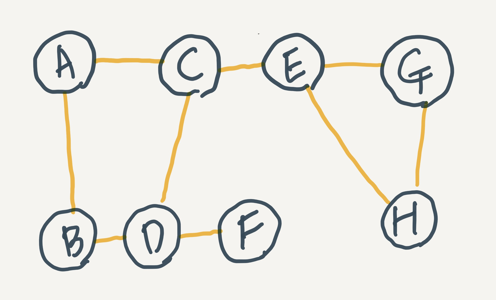
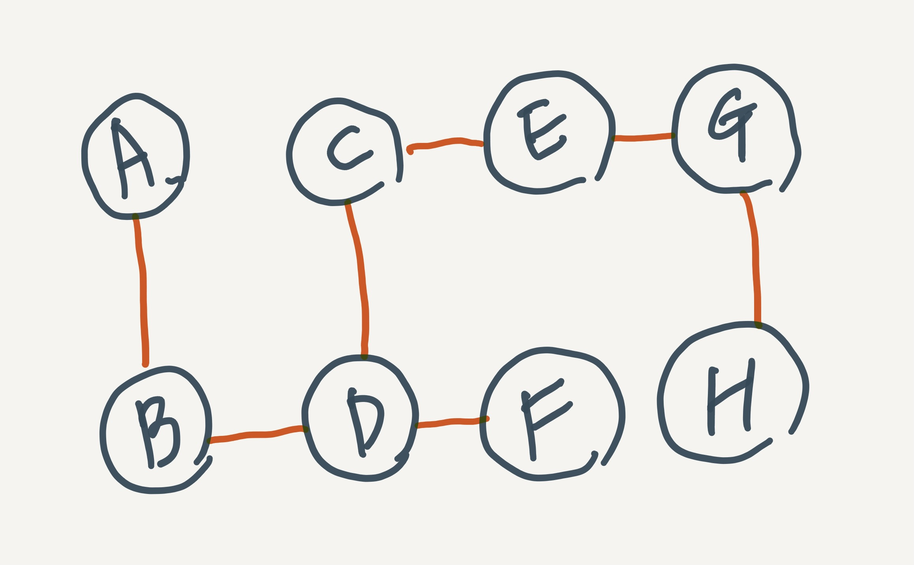
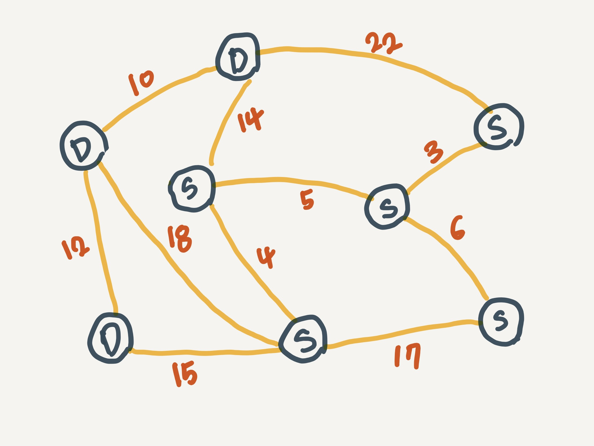
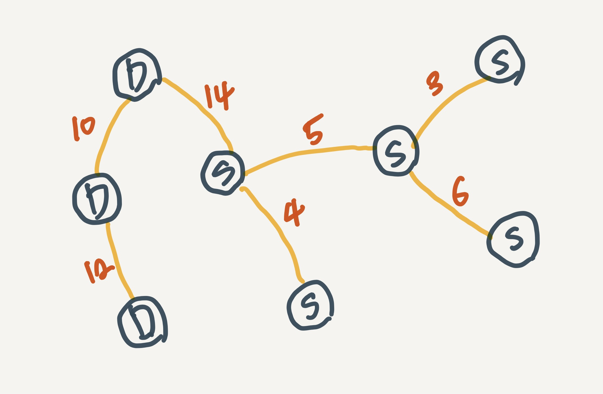

# Overview

Kruskal과 Prim 알고리즘을 공부하기 위해 먼저 기본적인 최소 신장 트리의 대한 개념 정리가 필요했다. 최소 신장 트리의 대한 개념 정리를 위해서는 그래프 이론 부터 시작해야 하지만 그래프와 트리 그리고 탐색 방법에 대해서는 다른 포스트에서 다루도록 하고 최소 신장 트리(Minimum Spanning Tree)를 이해하기 위해 최소한 개념, 가중치 그래프를 알아야 하기 때문에 먼저 가중치 그래프가 무엇인지 소개하고 신장 트리, 최소 신장 트리 순서로 정리하겠다.

# 가중치 그래프

그래프는 요소들이 복잡하게 서로 연결되어 있는 관계를 표현하는 자료구조다. 그래프 자료구조는 요소를 나타내는 정점(vertex), 요소 간의 관계인 간선(edge)로 이루어져 있는데, 단순히 관계만을 표현하는 간선이 아닌 특정한 가중치가 표현된 간선으로 이루어진 그래프를 가중치 그래프라고 한다.

## 가중치

간선에 가중치를 표현한다는 것은 정점을 연결하는데 필요한 비용을 함께 표현한다는 말이다. 간단한 예로 우리나라의 각 도시를 정점이라 하고 도시를 연결하는 고속도로를 간선이라 한다면 간선에 두 도시의 거리나 이동 비용 등을 나타낼 수 있다. 이외에도 인터넷망과 같은 컴퓨터 네트워크를 표현하기 위해 가중치 그래프가 활용될 수 있는데, 패킷을 효율적으로 전송하기 위해서는 가장 빠른 길을 찾아야 할 것이다. 하지만 전체 네트워크에서 물리적인 통신 케이블 종류에 따라 전송 속도가 차이가 날것이다. 때문에 그래프의 모든 간선에 동일한 가중치를 부여하는 것은 적절하지 않다. 이렇게 단순히 연결 정보만을 표현하는 간선보다는 비용을 표현할 수 있는 가중치를 두는 게 더 적절할 것이다.

# 신장 트리(spanning tree)

신장 트리는 그래프 내의 모든 정점을 포함하는 트리이다. 신장 트리도 트리의 일종이고 모든 정점들이 연결되어 있다. 또한 사이클이 없어야 한다. 신장 트리는 n개의 정점을 n-1개의 간선으로 연결하게 되는데, 신장 트리를 찾기 위해서는 깊이 우선 탐색(BFS), 너비 우선 탐색(DFS)을 이용할 수 있다.

위와 같은 연결 그래프에서 깊이 우선 탐색(DFS) 으로 모든 노드를 포함하는 트리를 표현하면 아래와 같다.

이번에는 너비 우선 탐색(BFS)로 표현하면 아래와 같다.

이런 식으로 어떤 정점을 기준으로 DFS/BFS를 할 것이냐에 따라 하나의 그래프에서 많은 신장 트리를 가질 수 있다. 즉, 신장 트리는 DFS/BFS 도중에 사용된 간선들만 모으면 만들 수 있다.

# 최소 비용 신장 트리(MST: minimum spanning tree)

앞서 컴퓨터 네트워크 통신망을 다시 한번 생각해보자. 가장 적은 비용으로 통신망을 구축하고자 한다면, 네트워크에 있는 모든 정점들을 가장 적은 수의 간선과 비용으로 연결하는 것이 좋다. 이때 최소 비용 신장 트리가 필요하다. 비용은 길이, 구축비용, 전송 시간 등의 가중치를 가질 수 있다.

위와 같은 서버(S), 데이터 센터(D)로 이루어진 네트워크 통신망인 가중치 그래프가 있다고 해보자. 각 간선의 가중치는 구축비용이라고 한다면 모든 정점이 연결되면서 구축비용이 가장 적게 드는 연결 방법을 구한다면 아래와 같이 될 것이다.

최소 비용 신장 트리를 구한다면 다음과 같은 조건을 만족해야 한다.

1. 간선의 가중치의 합이 최소이어야 한다.
2. 반드시 n - 1개의 간선만 사용해야 한다.
3. 사이클이 포함되어서는 안 된다.

이렇게 최소 비용 신장 트리를 구하는 방법에는 대표적으로 Kruskal과 Prim이 제안한 알고리즘이 있다.

두 알고리즘에 대한 포스팅은 직접 구현과 함께 할 것이다.

## Reference

- Michael T.Goodrich, Data Structure and Algorithms in c++ (2nd)
