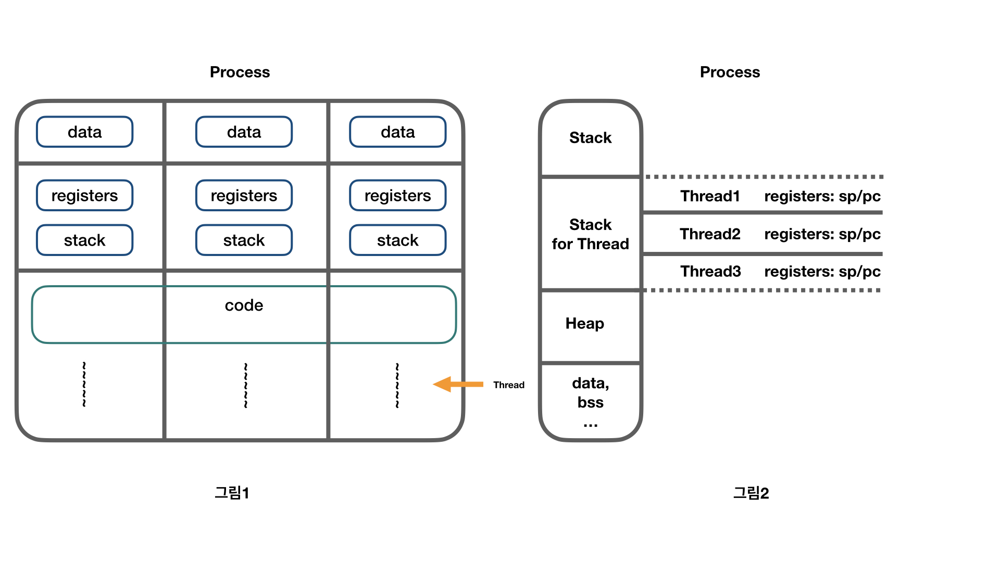
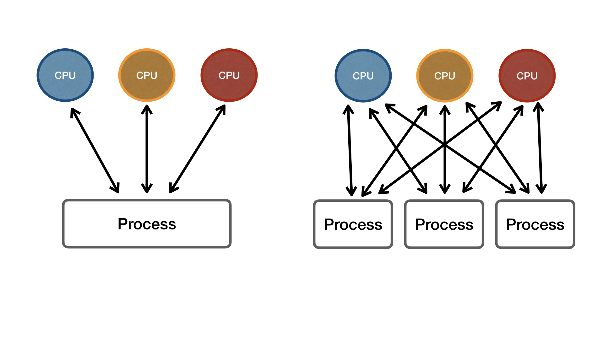

# Overview

Operating System에서 중요한 Thread에 대해서 정리하고자 한다. 이번 포스팅은 Thread의 개념 정도로 작성했다. 위키에서는 Thread를 **"어떠한 프로그램 내에서, 특히 프로세스 내에서 실행되는 흐름의 단위"**라고 정의하고 있다. 하지만 이 말은 확 와닿지 않아 해당 개념에 대해서 그동안 공부했던 내용을 바탕으로 정리했다. Thread 관련 여러 블로그가 많지만 내가 이해하고 있는 정리 포스트인 것이다.

이 글을 읽으시는 분들이 계시다면 잘못된 내용은 댓글로 지적해 주면 감사하겠습니다.

# Thread는 무엇인가?

**"Thread는 함수다"** 이 말을 가장 먼저 하는 이유는 어떤 코드로 작성된 프로그램이 실행되고 있는 런타임에서 실행된다는 말이다. 즉, 프로그램이 실행되는 런타임인 프로세스의 일부분이라는 말이다. 응용 계층에서 C언어와 같은 프로그래밍 언어를 이용하면 System Call을 직접 사용할 수 있는데 여기에 Thread 함수가 있다. POSIX 운영체제에서 Thread는 pTread라는 API가 있고 이를 코드 내에서 사용하여 Thread를 사용한다. 물론 다른 프로그래밍 언어에서도 라이브러리로 만들어진 Thread를 사용하여 Thread를 생성할 수 있다.

# Thread의 특징

Thread는 함수이기 때문에 코드상에서 함수를 여러 번 실행시킬 수 있다. 그럼으로 프로그램이 실행되면 하나의 프로세스에서 여러 개의 Thread가 생성될 수 있다. 또한 프로세스에서 실행되는 만큼 해당 프로세스의 메모리 자원을 공유할 수 있다.

여러 개의 프로세스는 데이터를 주고받을 수 없어 IPC 기법을 이용하기도 하는데, 여러 개의 Thread는 그림1과 같이 프로세스의 데이터를 모두 접근 가능하다. 또한 하나의 프로세스에서 여러 개의 Thread를 생성하는 것도 가능하다. 이것을 Muti Threading라고 하고 병행 작업 처리를 위해 사용된다. 그림2를 보면 하나의 프로세스에서 Thread를 생성했을 때 각 프로세스에 할당되는 메모리(가상메모리)에 Stack 영역에서 별도로 Thread를 위한 영역을 설정하여 Thread마다 Stack 영역에 저장되는 Register PC(Program Counter), SP(Stack Pointer)가 저장된다. 이렇게 Stack 영역을 나누어 분배함으로써 Thread가 동작하게 된다.

# Multi Processing과 Multi Threading

프로그램, 프로세스, 프로세서가 처음 컴퓨터를 배울 때 용어가 비슷해서 헷갈렸던 적이 있는 것처럼.. Multi Processing, Multi Threading 분명히 다르기 때문에 정리하자.

## Multi Processing

멀티 프로세싱은 여러 개의 프로세서(CPU)가 병렬로 서로 협력하며 일을 처리하는 것을 의미한다. 하나의 프로세스가 여러 개의 CPU 자원을 활용하기도 하고 여러 개의 프로세스가 여러 개의 CPU를 번갈아가며 자원을 사용하기도 하는 운영체제 스케줄링이라고 할 수 있다.

최근 CPU들은 멀티 코어를 가지고 있다. 여러 개의 프로세스로 여러 개의 CPU 자원을 활용해도 좋지만 왼쪽 그림에서 하나의 프로세스 내에 여러개의 Thread를 만들어 각 Tread가 CPU 자원을 활용하게 해도 된다. 이런 방법으로 작업 속도를 높여주는 운영체제 스케줄링에 의한 시스템을 Multi Processing이라고 한다.

## Multi Thread

Multi Treading은 위에서 언급했던 것과 같이 하나의 프로세스에서 여러 개의 Thread를 생성하여 서로 자원을 공유하면서 병행 작업 처리를 하는 프로세스 실행 흐름이다. 즉 프로세스는 프로세스 간의 자원 공유를 위해서는 IPC와 같은 기법을 이용해야 하지만 Thread는 하나의 프로세스에서 실행되는 실행 단위이기 때문에 자원 공유가 가능하다는 것이다.

실제로 함수를 호출할 때도 차이가 있다. 프로세스가 프로세스를 실행시킬 수도 있는데 fork()라는 시스템 콜을 이용해 프로세스를 여러 개로 늘려 여러 개의 프로그램을 병렬로 처리할 수도 있다. 여기서 차이점은 하나의 프로세스 내에서 병렬처리를 하느냐, 여러 개의 프로세스에서 병렬처리를 하느냐에 차이인 것이다.

운영체제는 각각의 프로세스마다 메모리를 부여하는데(리눅스에서 4GB) Multi Treading은 하나의 프로세스에서 공통된 메모리 자원을 사용하기 때문에 멀티 프로세싱보다 리소스를 덜 사용하는 장점이 있다. 하지만 하나의 프로세스 안에서 실행되기 때문에 하나의 Thread가 문제가 생기면 해당 프로세스 전체가 영향을 받을 수 있다. 반면 멀티 프로세싱은 각각 독립적인 실행 영역이기 때문에 하나의 프로세스가 문제가 생겨도 다른 프로세스에 영향을 주지 않는다.

# 정리

- Thread는 프로세스 안에서 생성되는 함수이고, Thread를 위한 별도의 Stack영역에 할당되어 메모리 자원을 공유 할 수 있다. 때문에 Thread를 여러개 생성하여 소프트웨어를 병행 작업처리를 할 수 있고 이것을 Multi Threading이라고 한다.
- 프로세스는 독립적인 실행 영역을 가지고 있고 운영체제에 의해 메모리를 할당 받는다. 프로세스가 또 다른 프로세스를 생성 할 수 있으며 fork() 시스템 콜을 사용해 생성하기도 하며 각 프로세스는 데이터 통신을 위해 IPC 기법을 사용해야 한다.
- Thread는 Stack 영역에서 pc/sp와 같은 레지스터를 사용하면서 CPU 자원을 활용하므로 CPU 활용도를 높인다. 또한 자원 공유를 할 수 있어 자원 효율성 면에서는 프로세스보다 좋다.
- 여러개의 Thread 중 하나의 Thread만 문제가 생겨도 해당 프로세스 전체에 영향을 줄 수 있다. 반면 프로세스는 독립적인 실행영역이기 때문에 하나의 프로세스가 문제가 생겨도 다른 프로세스에 영향을 주지 않는다.
- Multi Threading, Multi Processing은 Context Swiching이 빈번하게 일어날 수 있어 성능저하를 불러올 수 있음을 유의 해야한다.
